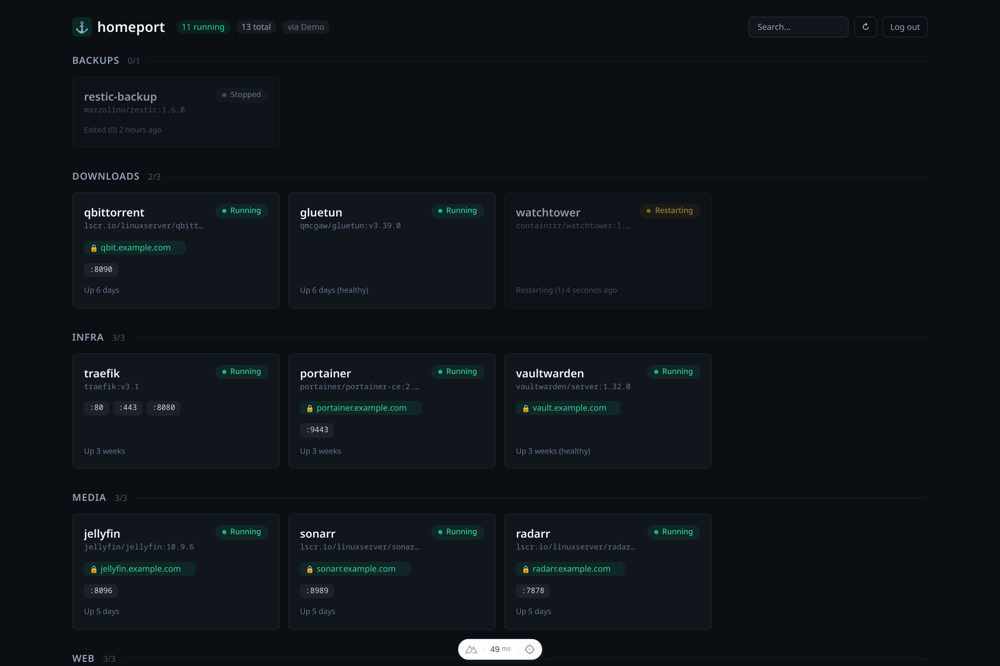

<div align="center">

# ⚓ homeport

**A zero-config status hub for your self-hosted Docker fleet.**

Point it at your Docker socket and your reverse proxy — it builds the dashboard for you.
No tiles to configure: every container shows up automatically, with its status and the
domain that points to it.

</div>



> Want to see it before wiring up Docker? Run it with `HOMEPORT_DEMO=true` for a
> synthetic fleet (the screenshot above is demo mode).

## Why

If you self-host, you already know what's running — it's just scattered across `docker ps`,
your reverse-proxy UI, and a dashboard you have to hand-edit every time you add a service.
homeport reads it all live:

- **Auto-discovers** every container (no manual config) — name, image, status, health, ports.
- **Auto-maps domains** from your reverse proxy. It knows `webapp → app.example.com`
  because it reads the proxy config — you don't tell it anything.
- **Live** — updates the moment a container starts, stops, or goes unhealthy (Docker events).
- **Grouped by stack** (Docker Compose project), searchable, dark by default.

It's a read-only *status hub*, not a management console — pair it with Portainer/Dockge if
you want to push buttons.

## Quick start

```yaml
# docker-compose.yml — see the full file in this repo
services:
  homeport:
    image: ghcr.io/<your-username>/homeport:latest
    environment:
      HOMEPORT_ADMIN_PASSWORD: change-me
      HOMEPORT_SESSION_SECRET: $(openssl rand -hex 32)
      DOCKER_HOST: tcp://docker-socket-proxy:2375
      NPM_CONF_DIR: /npm
    volumes:
      - /path/to/npm/data/nginx/proxy_host:/npm:ro   # optional: domain mapping
    ports: ["3004:3000"]
    networks: [npm-network, internal]
    depends_on: [docker-socket-proxy]

  docker-socket-proxy:                # read-only Docker API — no raw socket for the app
    image: tecnativa/docker-socket-proxy:latest
    environment: { CONTAINERS: 1, INFO: 1, EVENTS: 1, PING: 1 }
    volumes: ["/var/run/docker.sock:/var/run/docker.sock:ro"]
    networks: [internal]
```

```bash
cp .env.example .env   # set HOMEPORT_ADMIN_PASSWORD + HOMEPORT_SESSION_SECRET (+ NPM path)
docker compose up -d
# open http://<host>:3004 and log in
```

## Configuration

All via environment variables (set on the container at runtime):

| Variable | Default | Purpose |
|---|---|---|
| `HOMEPORT_ADMIN_PASSWORD` | — | Password for the single admin login (**required**). |
| `HOMEPORT_SESSION_SECRET` | dev fallback | Secret used to sign the session cookie. Set a long random value. |
| `DOCKER_HOST` | _(unix socket)_ | `tcp://docker-socket-proxy:2375` (recommended), or empty to use `DOCKER_SOCKET`. |
| `DOCKER_SOCKET` | `/var/run/docker.sock` | Used only when `DOCKER_HOST` is empty. |
| `NPM_CONF_DIR` | _(none)_ | Path (in-container) to Nginx Proxy Manager proxy-host confs. Omit to disable domain mapping. |
| `HOMEPORT_DEMO` | `false` | `true` serves a synthetic fleet (no Docker needed) — handy for a first look. |

### Per-service overrides (optional Docker labels)

Zero-config by default; add labels to any container to customize its card:

| Label | Effect |
|---|---|
| `hub.name` | Display name |
| `hub.group` | Override the group/stack it's filed under |
| `hub.icon` | An emoji/character shown before the name |
| `hub.hide` | `true` to hide it from the dashboard |

## Reverse-proxy support

v1 ships with **Nginx Proxy Manager** (parses its generated nginx confs, read-only).
The domain layer is behind a small `DomainProvider` interface, so **Traefik** and **Caddy**
can be added without touching the rest. PRs welcome.

## Security

- homeport never touches the raw Docker socket — it talks to a **read-only
  `docker-socket-proxy`** that only exposes container listing, info, events, and ping.
- The reverse-proxy config is mounted **read-only**.
- The whole UI/API is behind a login (it reveals your infra) — set a real password and put
  it behind HTTPS via your reverse proxy.

## Roadmap

- Resource stats (CPU/mem) per container
- Traefik + Caddy domain providers
- Uptime/HTTP health pings to domains
- systemd (non-Docker) services
- Multi-host

## License

MIT © Juniper Gray (Justin Alink)
